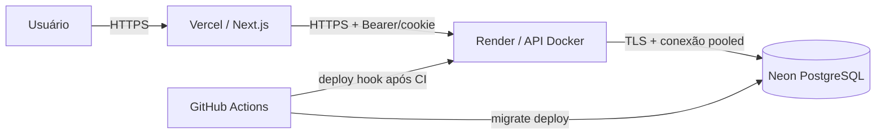

# Deploy e operação

## Ambientes

Há ambientes local, preview/homologação e produção. Cada ambiente possui variáveis próprias; segredos são fornecidos pelo provedor/CI e nunca entram no repositório.

## Containers

A API possui imagem multi-stage baseada em Node 24, executa com usuário `node`, não inclui os
devDependencies no runtime e expõe healthcheck de readiness. O frontend usa o runtime nativo da
Vercel, portanto não há Dockerfile de frontend. O Compose mantém PostgreSQL para desenvolvimento e
oferece a API no profile opcional `app`:

```bash
docker compose up -d postgres
docker compose --profile app up --build
```

Redis continua previsto na arquitetura, mas não é iniciado enquanto não houver um consumidor real.
O rate limiting é local ao processo; produção deve usar somente uma instância da API até migrar o
storage de throttling para Redis.

## CI/CD

O workflow `CI` roda em pull requests e pushes para `main`. Ele executa instalação reproduzível,
Prisma Generate, lint, typecheck, testes, build, auditoria das dependências de runtime, integrações e
E2E com PostgreSQL real, além do build da imagem da API.

O workflow `Deploy production` observa o sucesso do CI na `main`, mas só executa automaticamente
quando a variável `PRODUCTION_DEPLOY_ENABLED` vale `true`. Também pode ser iniciado manualmente. O
GitHub Environment `production` deve exigir aprovação enquanto o processo estiver sendo validado.

## Banco de dados

Migrations Prisma são versionadas e aplicadas de forma controlada no pipeline. Produção requer backup testado antes de migrations destrutivas e plano de rollback compatível com a mudança.

## Observabilidade e segurança

Registrar logs estruturados, erros de aplicação e health check. Monitorar disponibilidade, latência e falhas de jobs quando existirem. Rotacionar segredos por meio do provedor, aplicar HTTPS em produção e restringir acesso ao banco e Redis à rede privada.

Para sessão web, configure `WEB_ORIGIN` com a origem exata do frontend, `NEXT_PUBLIC_API_URL` com a base versionada da API e `AUTH_COOKIE_SECURE=true` em produção. CORS deve usar credenciais somente com origens explícitas; HTTPS é obrigatório para o cookie de refresh seguro.

Consulte `12-seguranca-e-testes.md` para os controles já aplicados, execução E2E isolada e o
checklist que deve ser concluído antes do primeiro deploy.

## Hospedagem escolhida

- frontend: Vercel, projeto com Root Directory `apps/web` e variável
  `NEXT_PUBLIC_API_URL=https://<api>/api/v1`;
- API: Render Web Service Docker, Blueprint `render.yaml`, uma instância e deploy automático
  desligado para o workflow controlar migrations e promoção;
- banco: Neon PostgreSQL na mesma região lógica da API, usando URL pooled com TLS;
- Redis: adiado até o escalonamento horizontal.

Os planos gratuitos são adequados a demonstração: o Render hiberna após inatividade e pode demorar
para responder; Neon e Vercel têm cotas. Um ambiente comercial deve usar planos pagos, backups
testados, alertas, região definida e orçamento aprovado.

## Diagrama de produção



## Configuração do GitHub

Crie o Environment `production` e cadastre:

- secrets `PROD_DATABASE_URL` e `RENDER_DEPLOY_HOOK_URL`;
- variables `PRODUCTION_API_URL` terminando em `/api/v1`, `PRODUCTION_WEB_URL` e, somente após a
  primeira validação manual, `PRODUCTION_DEPLOY_ENABLED=true`.

Proteja `main` exigindo pull request, branch atualizada, resolução de conversas e os checks
`Quality, tests and builds`, `PostgreSQL integration and E2E` e `Build API container`. Restrinja
push direto e force-push. Dependabot abre atualizações semanais, sem merge automático.

## Primeiro deploy

1. Crie o banco Neon e valide conexão pooled com `sslmode=require`.
2. Importe `render.yaml`, preencha as variáveis marcadas `sync: false` e gere um deploy hook.
3. Crie o projeto Vercel ligado à `main`, configure a raiz `apps/web` e a URL da API.
4. Configure os secrets/variables do GitHub e execute manualmente `Deploy production`.
5. Valide login, refresh de sessão, CORS, `/health`, `/ready`, logs e isolamento entre empresas.
6. Habilite o deploy automático somente depois do smoke test manual.

O seed é exclusivamente local/homologação controlada e nunca faz parte do pipeline de produção.

## Rollback e operação

Render e Vercel devem promover o último artefato saudável. Migrations são forward-only: mudanças
destrutivas exigem estratégia expand/contract e backup/restauração testados antes do deploy. Se a
migration falhar, o hook não é acionado e a versão anterior continua atendendo. Se o smoke test
falhar após a promoção, reverta os dois provedores e mantenha a migration compatível até um novo
deploy corretivo.

Monitore disponibilidade de `/health` e `/ready`, latência, `5xx`, `429` e falhas do workflow.
Logs seguem para stdout com request ID; segredos, tokens, cookies e corpos não devem ser logados.

## Troubleshooting

- CI sem conectar ao PostgreSQL: confira o healthcheck do service container e se ambas as URLs
  apontam para `erp_next_test`.
- Refresh retorna `403 INVALID_ORIGIN`: use a origem completa e exata do frontend em
  `CORS_ORIGINS`, sem barra final.
- Cookie não é enviado entre Vercel e Render: confirme HTTPS, `AUTH_COOKIE_SECURE=true`,
  `AUTH_COOKIE_SAME_SITE=none` e `credentials: include`.
- API não inicia no Render: valide secrets, `PORT`, `/api/v1/ready` e o log da validação de ambiente.
- Deploy não inicia: confirme o GitHub Environment, as quatro variables/secrets documentadas e
  `PRODUCTION_DEPLOY_ENABLED=true`.
- Migration falha: não acione seed nem force alteração manual; preserve o deploy anterior, revise a
  migration e teste a restauração antes de tentar novamente.
