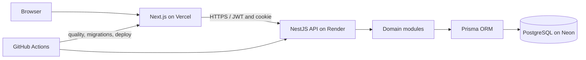
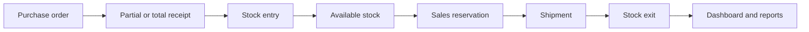

# ERP Next

🇧🇷 [Português](README.pt-BR.md)

[](https://github.com/ysantosengineer/erp-next/actions/workflows/ci.yml)


A production-oriented, multi-tenant ERP portfolio project covering access control, catalog, inventory, purchasing, sales, finance, dashboards, and reports.

[Live application](https://erp-next-web.vercel.app) · [API health](https://erp-next-api.onrender.com/api/v1/health) · [Architecture](docs/architecture-overview.md) · [Engineering case study](docs/portfolio-case.md)


## Overview

ERP Next is a modular full-stack ERP whose web and API applications are independently deployable. PostgreSQL is the operational source of truth, and every business workflow runs in the authenticated company context.

## The Problem

Small and medium businesses often run purchasing, stock, sales, and cash control in disconnected spreadsheets. ERP Next demonstrates how those workflows can share one consistent, traceable domain model without turning a portfolio application into a superficial CRUD showcase.

## The Solution

The system models the operational chain from a purchase order and receipt through stock availability, sales reservation and shipment, financial settlements, and management indicators.

## Features

### Authentication & Authorization

- JWT authentication with rotating refresh cookies, logout, and session recovery.
- Multi-company users, roles, permissions, and protected navigation.

### Master Data

- Categories, units, suppliers, products, customers, warehouses, and stock locations.

### Inventory

- Immutable stock movements, balances, transfers, adjustments, and physical inventory.

### Purchasing

- Purchase orders with partial and idempotent receipts.

### Sales

- Sales orders with reservation, release, cancellation, and shipment.

### Finance

- Payables, receivables, partial settlements, cash flow, dashboards, and reports.

### Analytics

- Period-filtered KPIs, comparisons, operational alerts, and paginated reports based on persisted data.
- Audit records for sensitive mutations and request-correlated structured logs.

## Engineering Highlights

- Database transactions protect stock, order, receipt, settlement, and inventory invariants.
- Physical, reserved, and available quantities are kept distinct: `physicalQuantity >= reservedQuantity` and `availableQuantity = physicalQuantity - reservedQuantity`. Reservation does not change physical stock; shipment appends a real exit.
- Tenant scope is enforced from the authenticated company context.
- RBAC checks are applied in the API and reflected in the interface.
- Idempotency prevents duplicate receipts, shipments, and financial settlements.
- Validation occurs at API boundaries; database entities are not exposed directly.
- CI verifies lint, types, tests, builds, PostgreSQL integration, E2E flows, runtime audit, and the API container.

## Architecture



See the [architecture overview](docs/architecture-overview.md) for module, RBAC, tenancy, finance, delivery, and data diagrams.

## Core Business Flow



The finance module consumes its own manual titles in this release; the diagram does not imply automatic accounting entries from sales or purchasing.

## Technology Stack

| Layer    | Technology                                                                           |
| -------- | ------------------------------------------------------------------------------------ |
| Web      | Next.js 16, React 19, TypeScript, Tailwind CSS, TanStack Query, React Hook Form, Zod |
| API      | NestJS 11, Prisma 6, JWT, Swagger/OpenAPI, class-validator                           |
| Data     | PostgreSQL 17                                                                        |
| Quality  | ESLint, Prettier, Jest, Vitest, Supertest                                            |
| Delivery | Docker, Docker Compose, GitHub Actions, Vercel, Render, Neon                         |

## Repository Structure

```text
apps/
  api/                 NestJS API, Prisma schema, migrations, and tests
  web/                 Next.js application and component tests
docs/                  Architecture, requirements, operation, and portfolio material
scripts/               Operational and CI helpers
.github/workflows/      CI and production delivery pipelines
```

## Security

The API uses explicit CORS origins, Helmet headers, payload limits, throttling, secure refresh-cookie configuration, environment validation, safe error responses, liveness/readiness probes, and audit trails. The current limiter is process-local, so production intentionally runs one API instance until a shared Redis-backed store is introduced. See [security and E2E testing](docs/12-seguranca-e-testes.md).

## Testing

Jest covers API units and services, Vitest covers web components and behavior, and Supertest E2E suites exercise the real NestJS application against isolated PostgreSQL. No coverage percentage is claimed.

## CI/CD

Pull requests and `main` pushes run installation, Prisma Generate, lint, typecheck, unit tests, builds, runtime dependency audit, PostgreSQL integration/E2E, and the API Docker build. A successful `main` pipeline can apply migrations, trigger Render, and run smoke checks. See [deployment](docs/10-deploy.md).

## Getting Started

### Prerequisites

Requirements: Node.js 24, npm 11, Docker, and Docker Compose.

### Installation

```bash
git clone https://github.com/ysantosengineer/erp-next.git
cd erp-next
npm ci
docker compose up -d postgres
cp .env.example .env
npm run prisma:generate
npm run prisma:migrate
npm run prisma:seed
```

### Environment Variables

Copy [`.env.example`](.env.example) and configure `DATABASE_URL`, `JWT_ACCESS_SECRET`, `JWT_REFRESH_SECRET`, `NEXT_PUBLIC_API_URL`, `WEB_ORIGIN`, `CORS_ORIGINS`, cookie settings, and optional seed values. Never commit real values.

### Database

Use `npm run prisma:migrate` for local development and `npm run prisma:migrate:deploy` for controlled production delivery. Seed is limited to local or controlled test/demo environments.

### Running the Application

```bash
npm run dev
```

Open `http://localhost:3000`. The API uses `http://localhost:3001/api/v1`. Local Swagger is available at `http://localhost:3001/api/docs` when `SWAGGER_ENABLED=true`; it is intentionally disabled in production.

The example environment file contains development-only placeholders. Never commit real credentials. Seeded accounts are for local demonstration only and must not be reused in production.

### Tests

```bash
npm run prisma:generate
npm run lint
npm run format:check
npm run typecheck
npm run test
npm run test:e2e
npm run build
```

E2E tests require an isolated PostgreSQL database whose name or schema ends in `_test`.

## API Documentation

Local Swagger is available at `http://localhost:3001/api/docs` when `SWAGGER_ENABLED=true`. It is intentionally disabled in production, so no public Swagger URL is advertised.

## Demo

Production deploys use Vercel for the web app, a Docker service on Render for the API, and pooled TLS connections to Neon. Free tiers are suitable for demonstration and can cold-start or enforce usage quotas.

## Screenshots

The real dashboard capture above is available. The curated 8–12 image plan and privacy checklist are in the [screenshot catalog](docs/assets/screenshots/README.md); pending images are explicitly marked and no mock image represents completed functionality.

## Technical Decisions

PostgreSQL provides relational constraints, transactions, concurrency controls, and reporting. Prisma provides typed access and versioned migrations, with targeted SQL used for locking or aggregates Prisma cannot express well. NestJS supplies modules, dependency injection, guards, and DTO boundaries. Next.js supplies the authenticated interface and React ecosystem inside the monorepo.

## Trade-offs

- The API uses modular NestJS services with direct Prisma access; a repository layer was avoided while it would only duplicate the ORM.
- Financial entries are manual in this version. Automatic posting from commercial documents is future work to avoid inventing accounting rules.
- Stock ledgers and settlements are append-only; corrections use explicit compensating operations where supported.
- Swagger is local-only in the public deployment to reduce exposed implementation detail.
- Redis is deferred until horizontal API scaling requires distributed throttling or cache coordination.

## Future Improvements

Password recovery, MFA/SSO, automated accounting entries, fiscal documents, reversals, exports, lots/serial numbers, advanced WMS, shared throttling, external APM, and automated backup validation are outside this release. An administrative audit-log viewer is also pending, although sensitive operations already write audit records.

## Documentation

Start with the [documentation index](docs/README.md), [Portuguese case study](docs/portfolio-case.pt-BR.md), [demo scripts](docs/demo-script.en.md), [deployment guide](docs/10-deploy.md), and [security/testing guide](docs/12-seguranca-e-testes.md).

## License

No open-source license has been granted yet. The source is publicly viewable for portfolio evaluation; reuse requires the author's permission.
