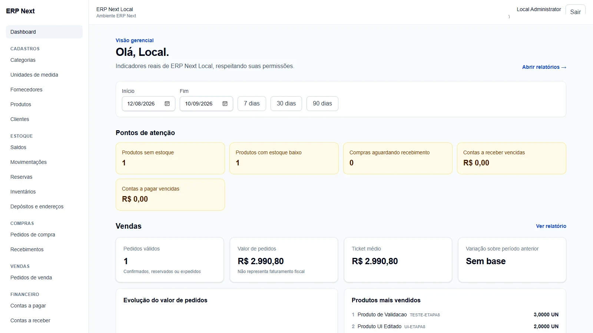
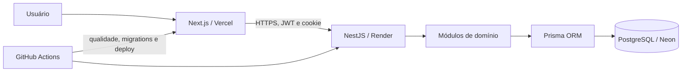

# ERP Next

🇺🇸 [English](README.md)

[](https://github.com/ysantosengineer/erp-next/actions/workflows/ci.yml)

ERP multiempresa orientado a produção, criado como portfólio Full Stack para demonstrar fluxos integrados de acesso, cadastros, estoque, compras, vendas, financeiro, dashboards e relatórios.

[Aplicação online](https://erp-next-web.vercel.app) · [Saúde da API](https://erp-next-api.onrender.com/api/v1/health) · [Arquitetura](docs/architecture-overview.md) · [Estudo de caso](docs/portfolio-case.pt-BR.md)



## Visão Geral

O ERP Next é um ERP full-stack modular cujas aplicações web e API podem ser implantadas separadamente. PostgreSQL é a fonte operacional e todos os workflows usam o contexto autenticado da empresa.

## O Problema

Pequenas e médias empresas frequentemente controlam compras, estoque, vendas e caixa em planilhas desconectadas. O ERP Next demonstra como reunir esses processos em um modelo consistente e auditável, indo além de um CRUD de portfólio.

## A Solução

O sistema representa a cadeia operacional do pedido e recebimento de compra até a disponibilidade, reserva e expedição de venda, baixas financeiras e indicadores gerenciais.

## Funcionalidades

### Autenticação e Autorização

- Autenticação JWT com refresh rotativo em cookie, logout e recuperação de sessão.
- Usuários, papéis e permissões com isolamento por empresa.

### Cadastros

- Categorias, unidades, fornecedores, produtos, clientes, depósitos e endereços.

### Estoque

- Saldos, transferências, ajustes, movimentos imutáveis e inventário físico.

### Compras

- Pedidos de compra e recebimentos parciais idempotentes.

### Vendas

- Pedidos de venda com reserva, liberação, cancelamento e expedição.

### Financeiro

- Contas a pagar/receber, baixas parciais, fluxo de caixa, dashboards e relatórios.

### Analytics

- KPIs por período, comparações, alertas operacionais e relatórios paginados baseados em dados persistidos.
- Auditoria de mutações sensíveis e logs estruturados com request ID.

## Destaques de Engenharia

- Transações protegem invariantes de estoque, pedidos, recebimentos, inventários e baixas.
- Quantidades física, reservada e disponível são separadas: `physicalQuantity >= reservedQuantity` e `availableQuantity = physicalQuantity - reservedQuantity`. Reserva não altera físico; expedição cria a saída real.
- Toda consulta de negócio recebe o contexto autenticado da empresa.
- RBAC é aplicado na API e refletido na navegação e nas ações da interface.
- Idempotência impede recebimentos, expedições e baixas duplicadas.
- Entradas externas são validadas e entidades do banco não são expostas diretamente.
- A CI valida lint, tipos, testes, builds, integração PostgreSQL, E2E, auditoria de runtime e imagem Docker.

## Arquitetura



Os demais diagramas estão na [visão geral de arquitetura](docs/architecture-overview.md).

## Fluxo Principal do Negócio

Fornecedor → pedido de compra → recebimento → estoque → pedido de venda → reserva → expedição. O financeiro usa títulos manuais nesta versão; esse fluxo não implica geração contábil automática.

## Stack Tecnológica

| Camada    | Tecnologias                                                                          |
| --------- | ------------------------------------------------------------------------------------ |
| Frontend  | Next.js 16, React 19, TypeScript, Tailwind CSS, TanStack Query, React Hook Form, Zod |
| Backend   | NestJS 11, Prisma 6, JWT, Swagger/OpenAPI, class-validator                           |
| Dados     | PostgreSQL 17                                                                        |
| Qualidade | ESLint, Prettier, Jest, Vitest, Supertest                                            |
| Entrega   | Docker, Docker Compose, GitHub Actions, Vercel, Render, Neon                         |

## Estrutura do Repositório

```text
apps/api/              API, Prisma, migrations e testes
apps/web/              aplicação Next.js e testes de componentes
docs/                  requisitos, arquitetura, operação e material de portfólio
scripts/               automações operacionais e de CI
.github/workflows/     integração e entrega contínuas
```

## Segurança

A API aplica CORS explícito, Helmet, limite de payload, throttling, cookie seguro, validação de ambiente, erros sanitizados, health checks e auditoria. Consulte [segurança e E2E](docs/12-seguranca-e-testes.md).

## Testes

Jest cobre unidades e serviços da API, Vitest cobre componentes web e Supertest executa o NestJS real contra PostgreSQL isolado. Nenhum percentual de cobertura é afirmado.

## CI/CD

Pull requests e a `main` executam instalação, Prisma Generate, lint, typecheck, testes, builds, audit de runtime, integração/E2E com PostgreSQL e build Docker. A entrega aplica migrations, aciona Render e faz smoke tests. Consulte [deploy](docs/10-deploy.md).

## Como Executar

### Pré-requisitos

Pré-requisitos: Node.js 24, npm 11, Docker e Docker Compose.

### Instalação

```bash
git clone https://github.com/ysantosengineer/erp-next.git
cd erp-next
npm ci
docker compose up -d postgres
cp .env.example .env
npm run prisma:generate
npm run prisma:migrate
npm run prisma:seed
```

### Variáveis de Ambiente

Copie [`.env.example`](.env.example) e configure `DATABASE_URL`, segredos JWT, URLs/origens, cookies e valores opcionais de seed. Nunca versione valores reais.

### Banco

Use `npm run prisma:migrate` no desenvolvimento e `npm run prisma:migrate:deploy` na entrega controlada. Seed é exclusivo para ambiente local ou demo/teste controlado.

### Executando a Aplicação

```bash
npm run dev
```

Acesse `http://localhost:3000`. A API usa `http://localhost:3001/api/v1`. O Swagger local fica em `http://localhost:3001/api/docs` quando `SWAGGER_ENABLED=true` e permanece desativado em produção.

As credenciais do arquivo de exemplo são apenas locais. Segredos reais nunca devem ser versionados, e contas de seed não devem ser reutilizadas em produção.

### Testes

```bash
npm run prisma:generate
npm run lint
npm run format:check
npm run typecheck
npm run test
npm run test:e2e
npm run build
```

Os testes E2E exigem banco PostgreSQL isolado cujo nome ou schema termine em `_test`.

## Documentação da API

O Swagger local fica em `http://localhost:3001/api/docs` com `SWAGGER_ENABLED=true`. Ele está intencionalmente desativado em produção, portanto não existe URL Swagger pública anunciada.

## Demo

O ambiente público usa Vercel, Render e Neon. Os planos gratuitos atendem à demonstração, mas podem hibernar, apresentar cold start e impor cotas.

## Screenshots

A captura real do dashboard aparece no topo. O [catálogo](docs/assets/screenshots/README.md) prepara 8–12 imagens e marca claramente as pendentes, sem mockups apresentados como funcionalidade pronta.

## Decisões Técnicas

PostgreSQL oferece integridade relacional, transações, concorrência e relatórios. Prisma fornece acesso tipado e migrations, com SQL pontual para locks/agregações não expressáveis. NestJS fornece módulos, DI, guards e DTOs; Next.js fornece a interface autenticada e o ecossistema React no monorepo.

## Trade-offs

Monólito modular reduz custo operacional frente a microservices; isolamento por linha reduz infraestrutura frente a banco por tenant; throttling local atende uma instância; ledgers imutáveis priorizam rastreabilidade; e o deploy gratuito aceita cold starts para viabilizar a demonstração.

## Melhorias Futuras

Os serviços NestJS acessam Prisma diretamente; uma camada de repository foi evitada enquanto apenas duplicaria a ORM. Lançamentos financeiros automáticos, regras fiscais, recuperação de senha, MFA/SSO, estornos, exportações, lotes/séries, WMS avançado, throttling distribuído, APM externo e validação automatizada de backups ficaram para evoluções futuras. A auditoria já é persistida, mas ainda não possui consulta administrativa própria.

## Documentação

Consulte o [índice](docs/README.md), o [estudo de caso](docs/portfolio-case.pt-BR.md), o [roteiro de demonstração](docs/demo-script.pt-BR.md), o [guia de deploy](docs/10-deploy.md) e o [guia de segurança e testes](docs/12-seguranca-e-testes.md).

## Licença

Ainda não foi concedida licença open source. O código está publicamente visível para avaliação de portfólio; reutilização depende de autorização do autor.
