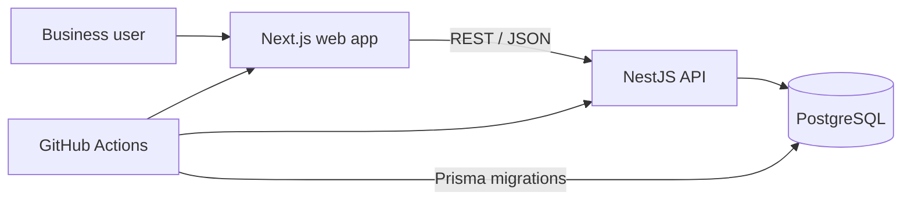
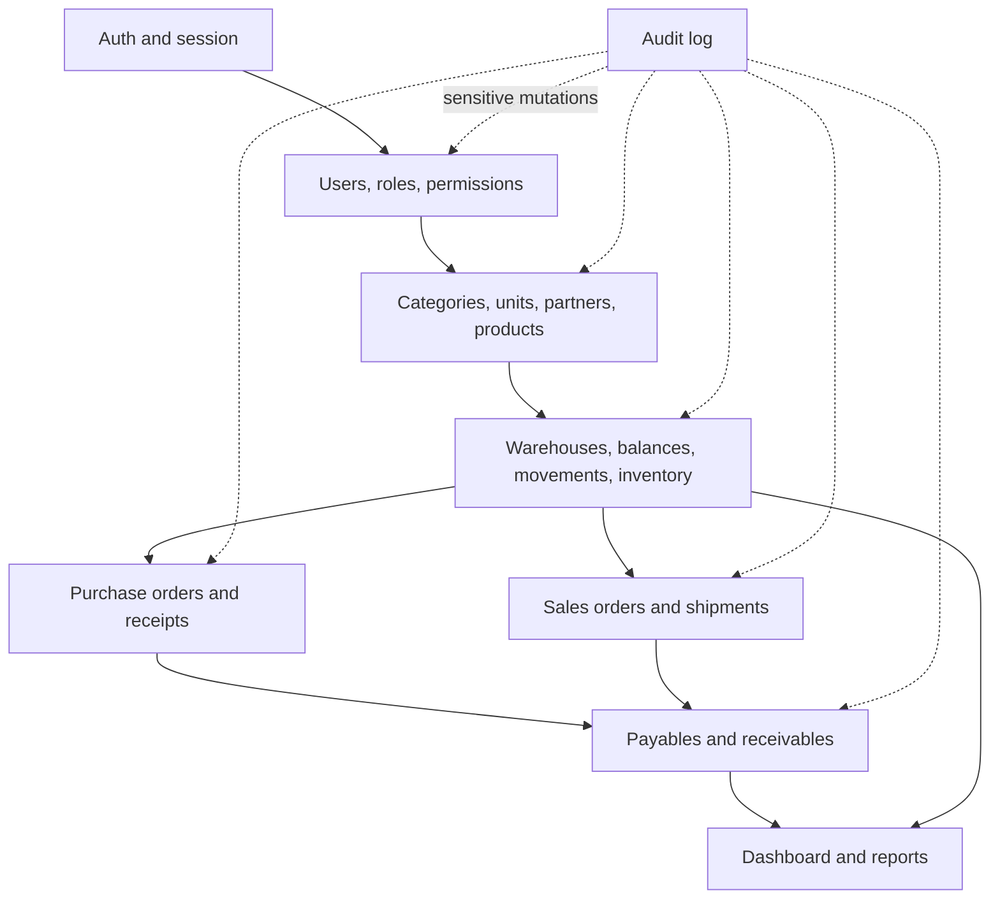
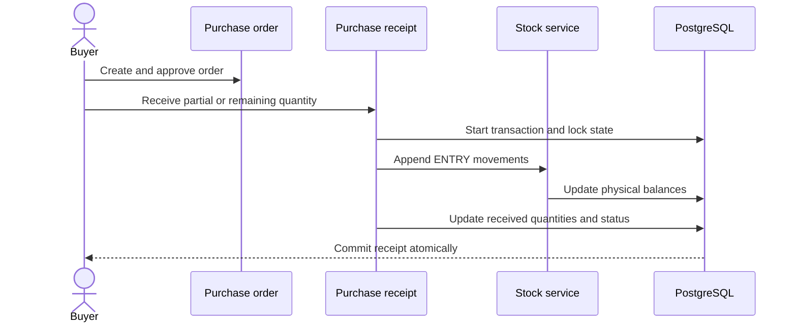
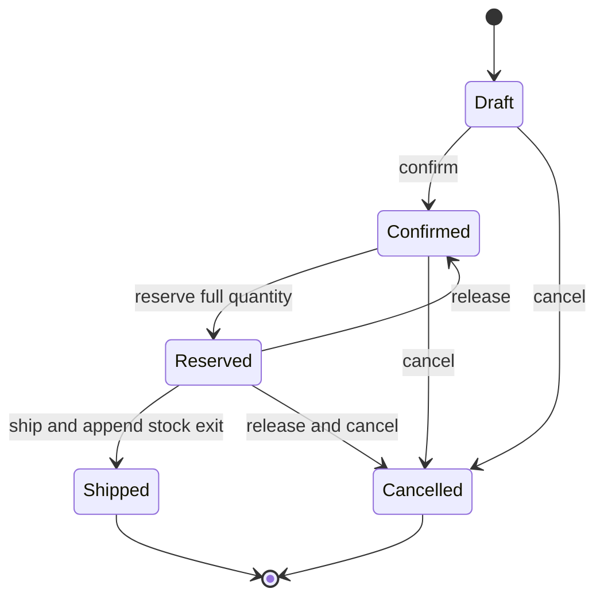
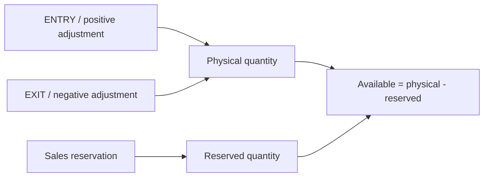
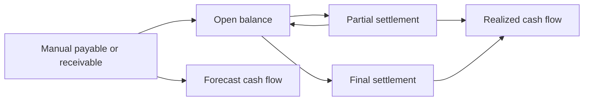
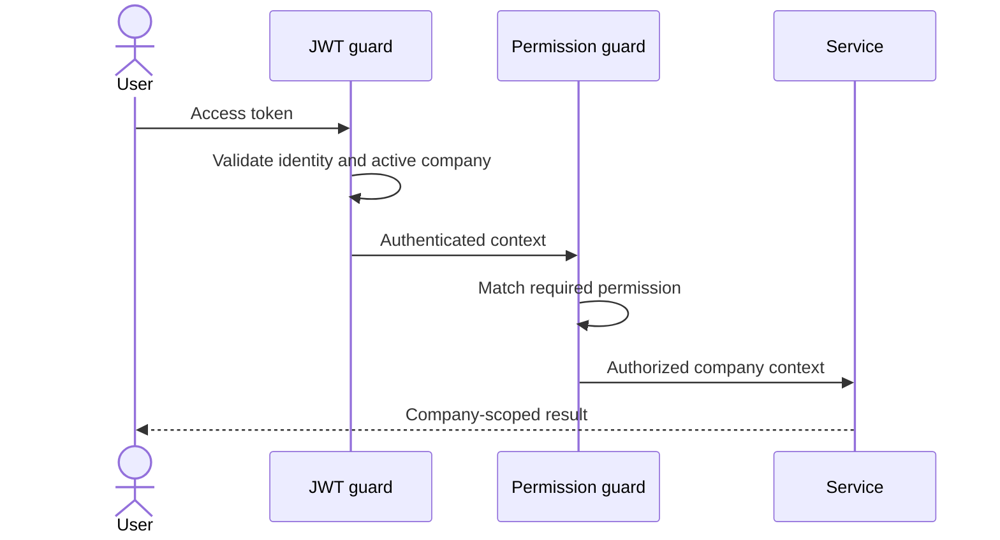
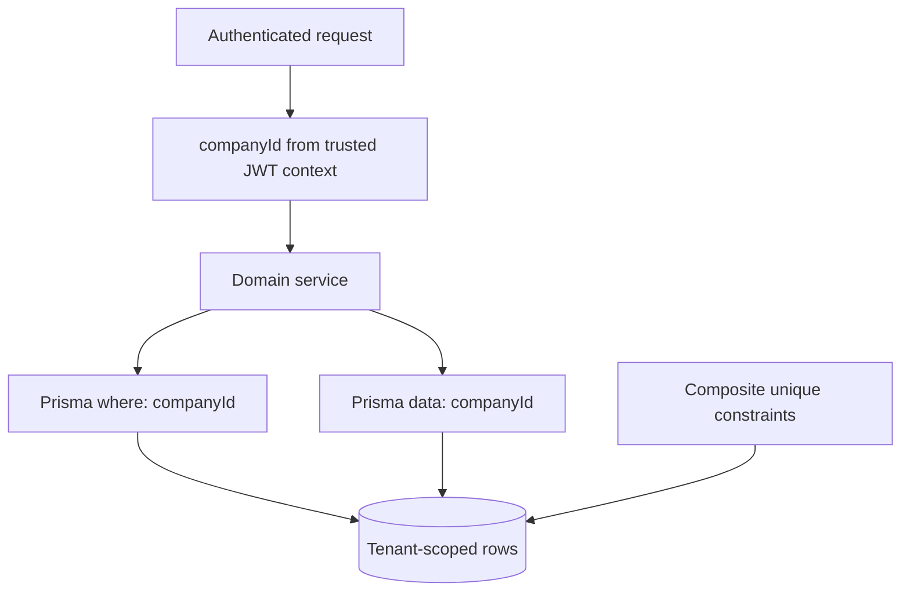
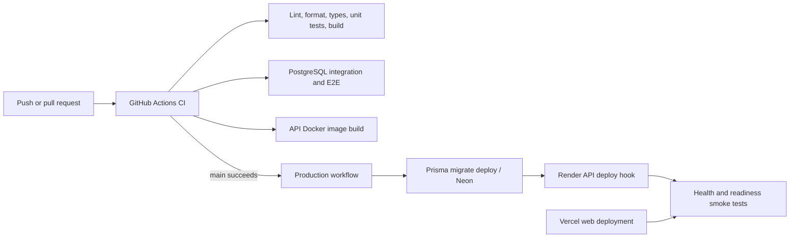
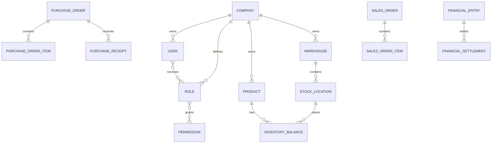

# Architecture overview

## System context

The frontend and API are independently deployable parts of one npm workspace. NestJS modules own validation and business rules; services use Prisma inside explicit transactions where a workflow changes related aggregates. PostgreSQL is the source of truth.

## Modular backend

The arrows express business dependency, not direct database access between UI screens. Automated financial posting from purchasing and sales is deliberately not implemented yet.

## Purchasing and stock

## Sales reservation and shipment

Physical quantity changes only on shipment. Reservation changes committed availability while preserving the physical balance.

## Inventory invariant

Movements are append-only. Balance updates and their ledger movement occur in the same transaction.

## Finance

Settlements are immutable and idempotent. Reversals and automatic entries from commercial documents are future work.

## Authorization

The UI hides actions the session cannot perform, but the API guard remains the security boundary.

## Multi-tenancy

Clients cannot choose another tenant through query or body fields. Business records carry `companyId`, queries filter it, relations are checked in the same scope, and uniqueness is generally composite per company.

## Delivery

## Simplified data model

For field-level detail, use the Prisma schema and [database documentation](04-modelagem-banco.md).
